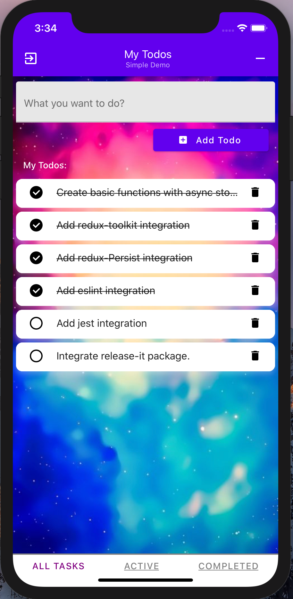

# React Native Sample App - todoist

## Overview

- We use this app for demo purpose, simple business logic but touch all the key concepts for jump starter

## things we covered in this demo

- `redux-toolkit`
- `redux-persist`
- `react-native-paper`
- `eslint`
- `jest`
- `typescrypt`

## Demo IOS Screen

You could just use some HTML in your Markdown:



### Commit message convention

We follow the [conventional commits specification](https://www.conventionalcommits.org/en) for our commit messages:

- `fix`: bug fixes, e.g. fix Button color on DarkTheme.
- `feat`: new features, e.g. add Snackbar component.
- `refactor`: code refactor, e.g. new folder structure for components.
- `docs`: changes into documentation, e.g. add usage example for Button.
- `test`: adding or updating tests, eg unit, snapshot testing.
- `chore`: tooling changes, e.g. change circleci config.
- `BREAKING CHANGE`: for changes that break existing usage, e.g. change API of a component.

Our pre-commit hooks verify that your commit message matches this format when committing.

### Linting and tests

We use `flow` for type checking, `eslint` with `prettier` for linting and formatting the code, and `jest` for testing. Our pre-commit hooks verify that the linter and tests pass when commiting. You can also run the following commands manually:

- `yarn flow`: run flow on all files.
- `yarn typescript`: run tests for typescript definitions.
- `yarn lint`: lint files with eslint and prettier.
- `yarn test`: run unit tests with jest.

### Sending a pull request

When you're sending a pull request:

- Prefer small pull requests focused on one change.
- Verify that `flow`, `eslint` and all tests are passing.
- Preview the documentation to make sure it looks good.
- Follow the pull request template when opening a pull request.

When you're working on a component:

- Follow the guidelines described in the [official material design docs](https://material.io/guidelines/).
- Write a brief description of every prop when defining `type Props` to aid with documentation.
- Provide an example usage for the component (check other components to get a idea).
- Update the type definitions for Flow and Typescript if you changed an API or added a component.

### Publishing a release

We use [release-it](https://github.com/webpro/release-it) to automate our release. If you have publish access to the NPM package, run the following from the master branch to publish a new release:

```sh
yarn release
```

NOTE: You must have a `GITHUB_TOKEN` environment variable available. You can create a GitHub access token with the "repo" access [here](https://github.com/settings/tokens).
